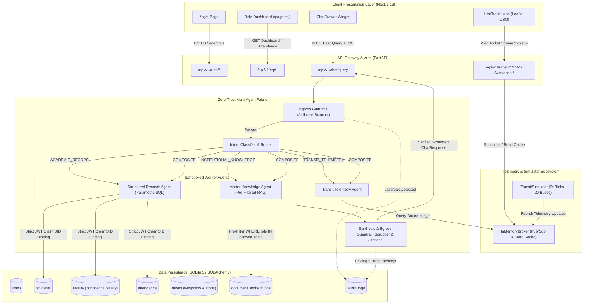
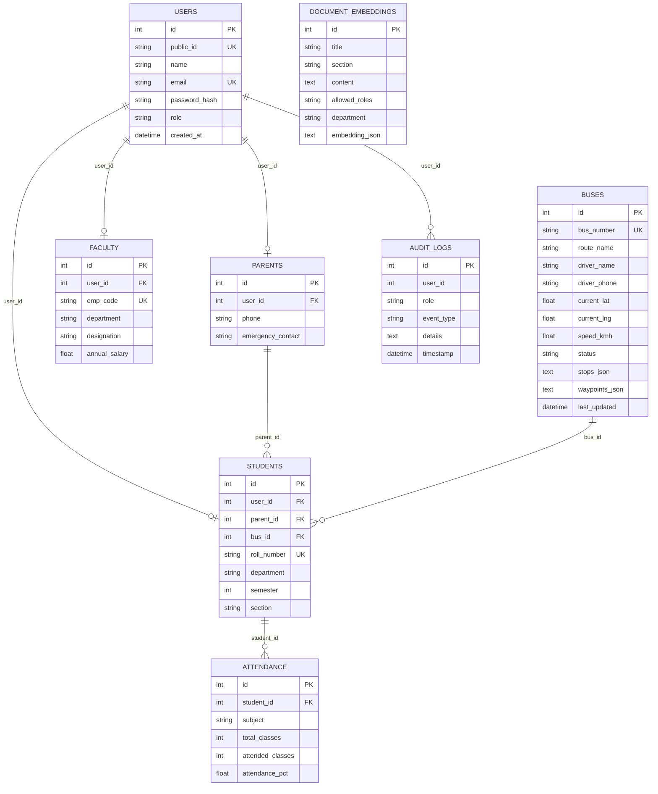
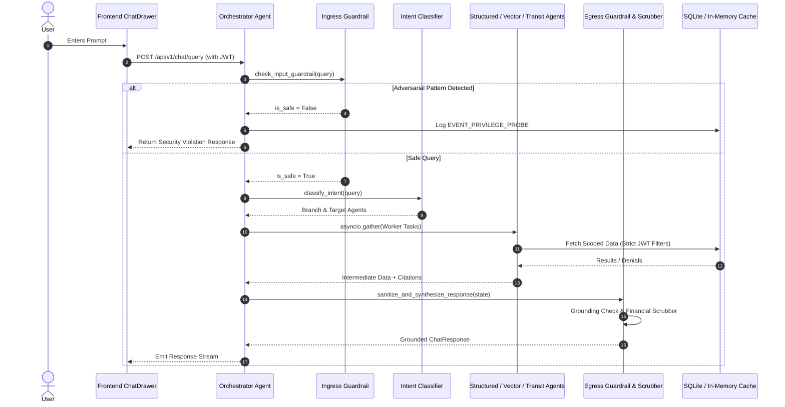

# NexusEdu / OmniCampus ERP — Complete Repository Technical Audit

> **Document Type:** Authoritative Codebase Technical Audit  
> **Repository:** NexusEdu (`OmniCampus ERP & SafeTransit`)  
> **Audit Date:** September 29, 2026  
> **Source of Truth:** Actual Source Code Analysis  

---

## 1. Executive Summary

### 1.1. System Overview
**NexusEdu** (internally titled **OmniCampus ERP & SafeTransit**) is an educational Enterprise Resource Planning (ERP) platform and real-time transit telemetry tracking system built around a **Zero-Trust Multi-Agent Role-Based Access Control (RBAC)** architecture. 

The application addresses two critical vulnerabilities present in traditional campus management portals:
1. **Unbounded Conversational AI Data Leaks:** Traditional LLM chat interfaces on ERP databases frequently expose confidential faculty salaries, examination keys, and cross-student records via prompt injection or unpartitioned context. NexusEdu eliminates this by replacing open text-to-SQL generation with a deterministic multi-agent supervisor pipeline enforcing parametric SQL isolation, database-level role pre-filtering, and strict egress boundary scrubbing.
2. **Transit & Commute Blindness:** Parents and students often lack visibility into daily transit operations. NexusEdu provides real-time vehicular GPS tracking streamed over WebSockets, displaying waypoint route polylines, animated vehicle beacons on OpenStreetMap cartography, and dynamic **500-meter geodesic geofencing proximity alerts**.

### 1.2. Current Implementation Status Summary

| Module | Documented Vision | Actual Codebase Implementation | Status |
| :--- | :--- | :--- | :--- |
| **Authentication & RBAC** | JWT with cryptographic claim binding (`user_id`, `role`, `department`, `student_id`, `ward_id`, `bus_id`) | Fully implemented via PyJWT and Bcrypt with 4 pre-seeded personas. | **Fully Implemented** |
| **Multi-Agent RAG Supervisor** | Zero-trust supervisor with Ingress Guard, Intent Router, Structured SQL Agent, Vector Agent, Transit Agent, and Egress Guard | Implemented as a deterministic Python async state machine with regex jailbreak defense, parametric SQL, and NumPy cosine similarity. | **Fully Implemented** (Deterministic Local Engine) |
| **LLM Inference Gateway** | External LLMs via Groq Cloud (Llama-3.1-70B/8B) or OpenAI GPT-4o-mini | Config parameters exist in `config.py`, but agent pipeline uses deterministic rule-based synthesis and local pseudo-embeddings without external API dependencies. | **Placeholder / Demo Mode** |
| **Database Architecture** | PostgreSQL 16 + pgvector | SQLite database (`campus.db`) using SQLAlchemy 2.0 async engine + `aiosqlite`. Embeddings stored as serialized JSON strings. | **Functional Demo Storage** |
| **Telemetry & Pub/Sub** | Redis 7 in-memory cache and Pub/Sub | In-memory Python `asyncio.Lock` and `asyncio.Queue` broker (`InMemoryBroker`) mimicking Redis `HSET`/`PUBLISH` semantics. | **Fully Implemented** (In-Memory) |
| **Transit GPS Simulator** | 20-bus mathematical progression with Gaussian jitter and Haversine distance | Fully implemented background `asyncio` task ticking every 3.0 seconds, updating coordinates and 500m geofence alerts. | **Fully Implemented** |
| **Frontend Presentation** | Next.js App Router, Leaflet OSM Map, Pure Vanilla CSS Minimalist Light Theme | Implemented with Next.js 16.3.6 (React 19.2.8), Leaflet 1.9.4, Lucide React, and pure Vanilla CSS tokens. | **Fully Implemented** |
| **Faculty Command Center** | Multi-section roster filtering, debarment advisories, course switching | Fully implemented multi-course and Section A/B roster filtering with status filters and advisory dispatches. | **Fully Implemented** |
| **Interactive Attendance Input** | Interactive professor UI to mark/update daily attendance records | Attendance data is read-only in the UI; no mutation form is present. | **Planned but Not Implemented** |
| **Bulk Synthetic Scale Generator** | Scripts to generate $\ge 1,000$ synthetic students | Pre-seeded with 8 students, 3 faculty, 1 parent, 1 admin, and 20 transit routes. | **Partial / Demo Scale** |

---

## 2. Repository Structure & Map

```
NexusEdu/
├── .agent/
│   └── rules/
│       └── env.md                        # Environment rule: python execution path
├── backend/
│   ├── app/
│   │   ├── __init__.py
│   │   ├── main.py                       # FastAPI application entrypoint, CORS, lifespan, routes
│   │   ├── agents/
│   │   │   ├── __init__.py
│   │   │   ├── ingress_guard.py          # Adversarial prompt & jailbreak regex defense
│   │   │   ├── intent_classifier.py      # Semantic query intent router
│   │   │   ├── orchestrator.py           # Master hierarchical state machine & audit logger
│   │   │   ├── structured_records.py     # Parametric SQL worker (attendance & payroll)
│   │   │   ├── vector_knowledge.py       # Metadata pre-filtered policy document retriever
│   │   │   ├── transit_telemetry.py      # Vehicle telemetry & route worker
│   │   │   └── egress_guard.py           # Context grounding validator & leak scrubber
│   │   ├── api/
│   │   │   ├── __init__.py
│   │   │   ├── auth.py                   # JWT login, token claims extraction, /me endpoint
│   │   │   ├── chat.py                   # /chat/query endpoint triggering multi-agent pipeline
│   │   │   ├── erp.py                    # /erp/dashboard, /attendance, /faculty/class-attendance, /audit-logs
│   │   │   └── transit.py                # /transit/buses, /transit/buses/{id}, and WebSocket streams
│   │   ├── core/
│   │   │   ├── __init__.py
│   │   │   ├── config.py                 # Pydantic BaseSettings (JWT, database, telemetry intervals)
│   │   │   ├── database.py               # SQLAlchemy async engine, sessionmaker & 8 entity models
│   │   │   ├── pubsub.py                 # In-memory Redis-compatible pub/sub and telemetry cache
│   │   │   └── security.py               # Bcrypt password hashing & PyJWT encoding/decoding
│   │   ├── models/
│   │   │   ├── __init__.py
│   │   │   └── schemas.py                # Pydantic request/response & graph state schemas
│   │   └── services/
│   │       ├── __init__.py
│   │       ├── seed_data.py              # Database seeder (demo users, buses, attendance, policies)
│   │       └── transit_simulator.py      # Background vehicle simulation loop & Geodesic Haversine engine
│   ├── campus.db                         # SQLite persistent database file
│   └── requirements.txt                  # Python dependencies
├── frontend/
│   ├── public/                           # Static SVG assets
│   ├── src/
│   │   ├── app/
│   │   │   ├── globals.css               # Minimalist high-contrast light theme & CSS variables
│   │   │   ├── layout.tsx                # Root layout with Inter font & Leaflet stylesheet
│   │   │   ├── page.tsx                  # Main tabbed dashboard & faculty command center
│   │   │   └── login/
│   │   │       └── page.tsx              # Modern authentication page with 1-click demo role chips
│   │   ├── components/
│   │   │   ├── Header.tsx                # Top navigation, logo, and interactive profile hover card
│   │   │   ├── Sidebar.tsx               # Role-partitioned navigation bar
│   │   │   ├── AttendanceCard.tsx        # SVG circular progress ring attendance cards
│   │   │   ├── LiveTransitMap.tsx        # Leaflet OSM map with live HUD, 500m geofence alert toast
│   │   │   └── ChatDrawer.tsx            # Floating RBAC assistant drawer with verified source badges
│   │   └── lib/
│   │       └── api.ts                    # Typed API client, fetchers, and WebSocket URL builder
│   ├── next.config.ts                    # Next.js config with API proxy rewrites to port 8000
│   ├── package.json                      # Next.js 16.3.6, React 19.2.8, Leaflet, Lucide React
│   └── tsconfig.json                     # TypeScript compiler configuration
├── AGENTS.md                             # Agent taxonomy & supervisor workflow specification
├── ARCHITECTURE.md                       # Architectural design document
├── PRD.md                                # Product Requirements Document
├── PROGRESS.md                           # Milestone tracking & changelog
├── README.md                             # Master project overview & setup guide
├── SYSTEM_DESIGN.md                      # System architecture & database schema specification
├── UI-UX_DESIGN_SPECIFICATIONS.md        # Interface design tokens & component specifications
└── start.sh                              # Bash startup script for Unix environments
```

### Detailed Component Inventory

| File / Directory | Purpose | Dependencies | Completeness | In-Use Status |
| :--- | :--- | :--- | :--- | :--- |
| `backend/app/main.py` | FastAPI entrypoint, lifespan startup/shutdown, CORS, router mounting, WS route. | `FastAPI`, `database.py`, `seed_data.py`, `transit_simulator.py` | 100% | **Active** |
| `backend/app/core/config.py` | Central application settings loaded via `pydantic-settings`. | `pydantic_settings` | 100% | **Active** |
| `backend/app/core/database.py` | SQLAlchemy models for User, Bus, Parent, Faculty, Student, Attendance, DocumentEmbedding, AuditLog. | `sqlalchemy`, `aiosqlite` | 100% | **Active** |
| `backend/app/core/security.py` | Bcrypt hashing and PyJWT token generation/decoding. | `bcrypt`, `pyjwt` | 100% | **Active** |
| `backend/app/core/pubsub.py` | Async in-memory key-value cache and channel pub/sub dispatcher. | `asyncio`, `json` | 100% | **Active** |
| `backend/app/models/schemas.py` | Pydantic data schemas for security claims, chat state, ERP records, and transit telemetry. | `pydantic` | 100% | **Active** |
| `backend/app/services/seed_data.py` | Populates database with 20 buses, 4 demo personas, faculty records, student attendance, and policy embeddings. | `numpy`, `sqlalchemy`, `security.py` | 100% | **Active** |
| `backend/app/services/transit_simulator.py` | Simulates live GPS vehicle movement along 20 cyclic waypoints with Gaussian jitter and Haversine geofencing. | `asyncio`, `math`, `random`, `pubsub.py` | 100% | **Active** |
| `backend/app/agents/orchestrator.py` | Coordinates multi-agent workflow: guardrail check $\rightarrow$ classification $\rightarrow$ worker fanout $\rightarrow$ aggregation $\rightarrow$ egress guard. | `asyncio`, `ingress_guard`, `intent_classifier`, worker agents | 100% | **Active** |
| `backend/app/agents/ingress_guard.py` | Regex perimeter guard against adversarial injection attempts. | `re` | 100% | **Active** |
| `backend/app/agents/intent_classifier.py` | Categorizes queries into `ACADEMIC_RECORD`, `INSTITUTIONAL_KNOWLEDGE`, `TRANSIT_TELEMETRY`, or `COMPOSITE`. | `re` | 100% | **Active** |
| `backend/app/agents/structured_records.py` | Binds queries strictly to verified JWT claims (`student_id`, `ward_id`), isolates payroll records. | `sqlalchemy`, `database.py` | 100% | **Active** |
| `backend/app/agents/vector_knowledge.py` | Pre-filters documents by `allowed_roles` and department before computing cosine similarity. | `numpy`, `sqlalchemy` | 100% | **Active** |
| `backend/app/agents/transit_telemetry.py` | Fetches vehicle coordinates from pubsub cache scoped to user's `bus_id`. | `pubsub.py`, `database.py` | 100% | **Active** |
| `backend/app/agents/egress_guard.py` | Evaluates grounding, formats grounded replies, scans outgoing text for unauthorized financial tokens. | `re`, `schemas.py` | 100% | **Active** |
| `backend/app/api/auth.py` | Implements `/api/v1/auth/login` and `/api/v1/auth/me`. | `database.py`, `security.py` | 100% | **Active** |
| `backend/app/api/chat.py` | Implements `/api/v1/chat/query`. | `orchestrator.py`, `auth.py` | 100% | **Active** |
| `backend/app/api/erp.py` | Implements `/erp/dashboard`, `/attendance`, `/faculty/class-attendance`, `/audit-logs`. | `database.py`, `pubsub.py`, `auth.py` | 100% | **Active** |
| `backend/app/api/transit.py` | Implements `/transit/buses`, `/transit/buses/{id}`, and WebSocket streaming handlers. | `database.py`, `pubsub.py`, `security.py` | 100% | **Active** |
| `frontend/src/lib/api.ts` | Frontend API client, typed fetch wrappers, session interfaces, and WebSocket URI generator. | Standard Fetch API | 100% | **Active** |
| `frontend/src/app/login/page.tsx` | Login page with 1-click demo role chips, password reveal toggle, and error handling. | `lib/api.ts`, `lucide-react` | 100% | **Active** |
| `frontend/src/app/page.tsx` | Main dashboard view with role-tailored KPI cards, faculty command center, and tab management. | Components, `lib/api.ts` | 100% | **Active** |
| `frontend/src/components/Header.tsx` | Sticky workspace banner with profile avatar and hover role inspection card. | `lucide-react`, `next/navigation` | 100% | **Active** |
| `frontend/src/components/Sidebar.tsx` | Role-filtered navigation links (Dashboard, Live Transit, Attendance/Class Roster, Audits). | `lucide-react` | 100% | **Active** |
| `frontend/src/components/LiveTransitMap.tsx` | Interactive Leaflet map with OpenStreetMap tiles, live telemetry HUD, and 500m geofence alert toast. | `leaflet`, `lucide-react` | 100% | **Active** |
| `frontend/src/components/AttendanceCard.tsx` | SVG circular progress ring rendering attendance percentages with health status badges. | `lucide-react` | 100% | **Active** |
| `frontend/src/components/ChatDrawer.tsx` | Floating conversation drawer with quick query chips, citation tags, and RBAC denial alerts. | `lucide-react`, `lib/api.ts` | 100% | **Active** |

---

## 3. Technology Stack Comparison

| Layer | Documented Technology | Actual Implemented Technology | Purpose | Evidence in Code |
| :--- | :--- | :--- | :--- | :--- |
| **Backend Framework** | FastAPI (Python 3.11) | FastAPI 0.110+ (Python 3.10+) | Asynchronous REST API & WebSockets | [`backend/requirements.txt:1`](file:///c:/Users/neuro/Downloads/NexuxEdu/backend/requirements.txt#L1), [`backend/app/main.py:3`](file:///c:/Users/neuro/Downloads/NexuxEdu/backend/app/main.py#L3) |
| **ASGI Server** | Uvicorn | Uvicorn 0.28+ with Standard extras | High-concurrency ASGI server | [`backend/requirements.txt:2`](file:///c:/Users/neuro/Downloads/NexuxEdu/backend/requirements.txt#L2) |
| **Relational Database** | PostgreSQL 16 | SQLite 3 (`campus.db`) | Data persistence for users, fleet, academic records | [`backend/app/core/config.py:16`](file:///c:/Users/neuro/Downloads/NexuxEdu/backend/app/core/config.py#L16), [`backend/campus.db`](file:///c:/Users/neuro/Downloads/NexuxEdu/backend/campus.db) |
| **Database ORM** | SQLAlchemy 2.0 (Async) | SQLAlchemy 2.0.28 + aiosqlite 0.20.0 | Asynchronous database access & entity models | [`backend/app/core/database.py:1-97`](file:///c:/Users/neuro/Downloads/NexuxEdu/backend/app/core/database.py#L1-L97) |
| **Authentication** | PyJWT + Bcrypt | PyJWT 2.8.0 + Bcrypt 4.0.1 | Password hashing (salt rounds = 10) & HS256 JWT claim signing | [`backend/app/core/security.py:1-32`](file:///c:/Users/neuro/Downloads/NexuxEdu/backend/app/core/security.py#L1-L32) |
| **Telemetry Broker** | Redis 7 (Pub/Sub + Geo) | Python `InMemoryBroker` (`asyncio.Queue` + Dict) | In-memory pub/sub message dispatch and telemetry caching | [`backend/app/core/pubsub.py:5-63`](file:///c:/Users/neuro/Downloads/NexuxEdu/backend/app/core/pubsub.py#L5-L63) |
| **Vector Search** | PostgreSQL `pgvector` | Deterministic pseudo-embedding + NumPy cosine similarity | Semantic vector distance scoring for policy retrieval | [`backend/app/agents/vector_knowledge.py:11-18`](file:///c:/Users/neuro/Downloads/NexuxEdu/backend/app/agents/vector_knowledge.py#L1-L95), [`seed_data.py:11-15`](file:///c:/Users/neuro/Downloads/NexuxEdu/backend/app/services/seed_data.py#L11-L15) |
| **LLM Inference** | Groq Cloud (Llama-3.1-70B/8B) / OpenAI | Deterministic rule-based template generation | Conversational responses without external API latency | [`backend/app/agents/egress_guard.py:5-115`](file:///c:/Users/neuro/Downloads/NexuxEdu/backend/app/agents/egress_guard.py#L5-L115) |
| **Frontend Framework** | Next.js 14 App Router | Next.js 16.3.6 (React 19.2.8, TypeScript 5) | Component rendering, SSR/CSR, client-side routing | [`frontend/package.json:14-16`](file:///c:/Users/neuro/Downloads/NexuxEdu/frontend/package.json#L14-L16) |
| **Mapping Engine** | Leaflet.js + OpenStreetMap | Leaflet 1.9.4 with standard OSM tiles | Interactive transit map canvas, polylines, stop pins, animated markers | [`frontend/src/components/LiveTransitMap.tsx:1-624`](file:///c:/Users/neuro/Downloads/NexuxEdu/frontend/src/components/LiveTransitMap.tsx#L1-L624) |
| **Icons Library** | Lucide React | Lucide React 1.48.0 | Minimalist UI vector icons | [`frontend/package.json:13`](file:///c:/Users/neuro/Downloads/NexuxEdu/frontend/package.json#L13) |
| **Styling System** | Pure Vanilla CSS | Custom CSS variables in `globals.css` | High-contrast minimalist light theme | [`frontend/src/app/globals.css:1-158`](file:///c:/Users/neuro/Downloads/NexuxEdu/frontend/src/app/globals.css#L1-L158) |

---

## 4. System Architecture & Execution Data Flow



---

## 5. Backend Deep Dive & API Endpoint Catalog

### 5.1. Application Configuration & Security Pipeline
- **Settings Loader:** Implemented in [`backend/app/core/config.py`](file:///c:/Users/neuro/Downloads/NexuxEdu/backend/app/core/config.py) using Pydantic `BaseSettings`.
- **JWT Secret & Token Lifecycle:** Uses HS256 algorithm with a default 24-hour expiration (`ACCESS_TOKEN_EXPIRE_MINUTES = 1440`).
- **Claim Extraction Middleware:** The dependency function `get_current_user_claims()` in [`backend/app/api/auth.py`](file:///c:/Users/neuro/Downloads/NexuxEdu/backend/app/api/auth.py#L11-L24) extracts and validates the Bearer token, producing a strongly-typed `UserSecurityClaims` object.

### 5.2. Exhaustive API Endpoint Catalog

#### 1. Authentication Endpoints

##### `POST /api/v1/auth/login`
- **Purpose:** Authenticates user credentials and returns a signed JWT containing session claims.
- **Authentication:** None (Public).
- **Authorization:** None.
- **Request Body:** `LoginRequest` (`{"email": "...", "password": "..."}`).
- **Response Body:** `TokenResponse` (`{"access_token": "...", "token_type": "bearer", "user": {...}}`).
- **Database Interaction:** Executes SQL query on `users`, then loads role profile from `students`, `faculty`, or `parents`.
- **Validation:** Bcrypt hash check, email normalization.
- **Error Handling:** Returns `401 Unauthorized` on bad credentials.
- **Status:** **FULLY IMPLEMENTED**

##### `GET /api/v1/auth/me`
- **Purpose:** Returns the profile and claims of the authenticated caller.
- **Authentication:** Bearer JWT required.
- **Request Body:** None.
- **Response Body:** `UserResponse`.
- **Database Interaction:** None (decoded from token claims).
- **Status:** **FULLY IMPLEMENTED**

#### 2. Conversational Agent Endpoints

##### `POST /api/v1/chat/query`
- **Purpose:** Ingress for conversational queries processed through the Zero-Trust Multi-Agent State Machine.
- **Authentication:** Bearer JWT required.
- **Request Body:** `ChatRequest` (`{"message": "...", "conversation_history": []}`).
- **Response Body:** `ChatResponse` (`{"reply": "...", "sources": [...], "classified_intent": "...", "access_denied": false, "audit_flag": null}`).
- **Database Interaction:** Reads `document_embeddings`, `attendance`, `faculty`, `students`; writes to `audit_logs` upon privilege probes.
- **Validation:** Regex guardrail check, intent extraction, role metadata pre-filter.
- **Error Handling:** Returns standard refusal on empty/unauthorized context; persists security violation event.
- **Status:** **FULLY IMPLEMENTED**

#### 3. ERP Academic & Management Endpoints

##### `GET /api/v1/erp/dashboard`
- **Purpose:** Retrieves role-specific high-level dashboard data.
- **Authentication:** Bearer JWT required.
- **Authorization:** Behavior dynamically tailors based on `claims.role`:
  - `student` / `parent`: Calculates aggregate attendance %, lists course attendances, fetches assigned bus telemetry.
  - `faculty`: Counts enrolled department students, counts section sizes, lists courses.
  - `admin`: Total users, active buses, total audit events, recent 5 audit logs.
- **Response Body:** JSON dictionary tailored to role.
- **Database Interaction:** Queries `attendance`, `students`, `faculty`, `users`, `buses`, `audit_logs`.
- **Status:** **FULLY IMPLEMENTED**

##### `GET /api/v1/erp/attendance`
- **Purpose:** Retrieves subject-by-subject attendance records for student or parent's ward.
- **Authentication:** Bearer JWT required.
- **Authorization:** `claims.student_id` or `claims.ward_id` must be present.
- **Response Body:** `List[AttendanceRecord]`.
- **Database Interaction:** Queries `attendance` WHERE `student_id = :sid`.
- **Status:** **FULLY IMPLEMENTED**

##### `GET /api/v1/erp/faculty/class-attendance`
- **Purpose:** Returns comprehensive class attendance rosters and section breakdown.
- **Authentication:** Bearer JWT required.
- **Authorization:** Strictly restricted to `claims.role in ['faculty', 'admin']`. Other roles receive `403 Forbidden`.
- **Query Parameters:** `subject` (Optional, string), `section` (Optional, string).
- **Response Body:** `FacultyAttendanceRosterResponse` containing summary metrics (safe count, attention count, debarment risk count) and student roster.
- **Database Interaction:** Joins `students`, `users`, and `attendance` filtered by department, subject, and section.
- **Status:** **FULLY IMPLEMENTED**

##### `GET /api/v1/erp/audit-logs`
- **Purpose:** Retrieves recent security audit entries for zero-trust compliance review.
- **Authentication:** Bearer JWT required.
- **Authorization:** Restricted to `claims.role == 'admin'`. Other roles receive `403 Forbidden`.
- **Response Body:** List of audit records (max 50, descending timestamp).
- **Database Interaction:** Queries `audit_logs` table.
- **Status:** **FULLY IMPLEMENTED**

#### 4. Transit Telemetry & WebSocket Endpoints

##### `GET /api/v1/transit/buses`
- **Purpose:** Returns the fleet directory of all 20 buses.
- **Authentication:** Bearer JWT required.
- **Response Body:** `List[BusDetails]`.
- **Database Interaction:** Reads `buses` table merged with cached live speed and coordinates from `InMemoryBroker`.
- **Status:** **FULLY IMPLEMENTED**

##### `GET /api/v1/transit/buses/{bus_id}`
- **Purpose:** Returns stops, waypoints, and telemetry for a single bus.
- **Authentication:** Bearer JWT required.
- **Authorization:** If caller is `student` or `parent` and has an assigned `bus_id`, querying any different `bus_id` raises `403 Forbidden`.
- **Response Body:** `BusDetails`.
- **Database Interaction:** Reads `buses` table.
- **Status:** **FULLY IMPLEMENTED**

##### `WS /ws/transit/{bus_id}` (and alias `WS /api/v1/transit/stream/{bus_id}`)
- **Purpose:** Real-time bidirectional WebSocket coordinate broadcasting.
- **Authentication:** Query parameter `?token=<JWT>` decoded upon connection.
- **Authorization:** Students/parents cannot subscribe to unassigned bus IDs (closes connection with code `1008 Policy Violation`).
- **Data Emitted:** Telemetry payload containing `lat`, `lng`, `speed_kmh`, `next_stop`, `next_stop_eta_mins`, `distance_to_stop_km`, `geofence_active`, `distance_to_registered_stop_m`.
- **Broadcast Interval:** 3.0 seconds per tick.
- **Status:** **FULLY IMPLEMENTED**

##### `GET /health` and `GET /api/v1/health`
- **Purpose:** Service health check probe.
- **Authentication:** None (Public).
- **Response Body:** `{"status": "healthy", "service": "...", "version": "1.0.0"}`.
- **Status:** **FULLY IMPLEMENTED**

---

## 6. Database Entity Models & Data Schema

The database layer utilizes SQLAlchemy 2.0 declarative mapping targeting SQLite (`campus.db`).



---

## 7. Frontend Architecture & User Flows

### 7.1. Technology & Design System
- **Framework:** Next.js 16.3.6 (React 19.2.8, TypeScript).
- **Styling Paradigm:** Pure Vanilla CSS using custom design tokens in [`frontend/src/app/globals.css`](file:///c:/Users/neuro/Downloads/NexuxEdu/frontend/src/app/globals.css).
- **Theme:** High-contrast Minimalist Light Theme (`--surface-dark: #FFFFFF`, `--surface-card: #FFFFFF`, `--surface-elevated: #F8FAFC`, `--text-main: #0F172A`).
- **Role Color Badges:**
  - Student: Sky Blue (`#0284C7`)
  - Faculty: Emerald Green (`#059669`)
  - Parent: Amber / Transit Orange (`#D97706`)
  - Admin: Purple / Violet (`#7C3AED`)

### 7.2. Major User Journeys & End-to-End Traces

#### Flow 1: Authentication & Role Discovery
1. **User Action:** User visits `/` $\rightarrow$ Redirected to `/login` if unauthenticated. User clicks a demo quick-fill chip (e.g. `faculty@campus.edu`) and clicks "Sign In".
2. **Frontend:** [`frontend/src/app/login/page.tsx`](file:///c:/Users/neuro/Downloads/NexuxEdu/frontend/src/app/login/page.tsx) invokes `login("faculty@campus.edu", "password123")` via [`frontend/src/lib/api.ts`](file:///c:/Users/neuro/Downloads/NexuxEdu/frontend/src/lib/api.ts).
3. **API & Service:** FastAPI endpoint `POST /api/v1/auth/login` checks bcrypt hash, constructs signed JWT with claims (`role="faculty"`, `department="Computer Science"`), and returns session payload.
4. **State Storage:** Frontend stores token and user in `localStorage.setItem("omnicampus_session")` and navigates to `/`.
5. **Dashboard Initialization:** [`frontend/src/app/page.tsx`](file:///c:/Users/neuro/Downloads/NexuxEdu/frontend/src/app/page.tsx) mounts, reads claims, configures navigation items, loads `/api/v1/erp/dashboard`, and renders the Faculty Command Center.

#### Flow 2: Live Transit Telemetry & 500m Geofencing
1. **User Action:** Parent or Student logs in and selects the **Live Transit** tab in the sidebar.
2. **Frontend:** [`frontend/src/components/LiveTransitMap.tsx`](file:///c:/Users/neuro/Downloads/NexuxEdu/frontend/src/components/LiveTransitMap.tsx) initializes Leaflet map with OSM tiles, draws the route polyline, and establishes a WebSocket connection to `ws://localhost:8000/ws/transit/1?token=<JWT>`.
3. **Backend Service:** Background worker in [`backend/app/services/transit_simulator.py`](file:///c:/Users/neuro/Downloads/NexuxEdu/backend/app/services/transit_simulator.py) ticks every 3 seconds, interpolating coordinates with Gaussian jitter. It computes the Haversine distance to the registered pickup stop ("Midtown Gate").
4. **WebSocket Push:** When distance $\le 500\text{ meters}$, payload broadcasts `geofence_active: true` and `distance_to_registered_stop_m: 454`.
5. **UI Rendering:** Leaflet marker animates position smoothly, the Telemetry HUD updates speed/ETA, and the glowing **"500M GEOFENCE PROXIMITY ALERT"** toast banner slides in at the top right.

#### Flow 3: Zero-Trust AI Assistant & Cross-Role Privilege Probe Intercept
1. **User Action:** Student Jane Doe opens the Chat Drawer and submits: `"Show all faculty salaries in Computer Science"`.
2. **Frontend:** Sends payload to `POST /api/v1/chat/query` with Student JWT Bearer token.
3. **Backend Multi-Agent Execution:**
   - `ingress_guard.py`: Query passes perimeter jailbreak check.
   - `intent_classifier.py`: Classified as `ACADEMIC_RECORD` $\rightarrow$ Routes to `structured_records.py`.
   - `structured_records.py`: Detects salary lookup pattern (`salary|payroll|compensation`). Recognizes user role is `student`. **Access is immediately blocked at retrieval layer** without touching faculty salary columns. Returns `authorized: False`.
   - `orchestrator.py`: Captures rejection and logs `EVENT_PRIVILEGE_PROBE` to `audit_logs` table.
   - `egress_guard.py`: Constructs explicit refusal: `"🔒 Restricted Access: You do not have authorization to view faculty compensation data..."`.
4. **UI Response:** Chat message displays in a distinct red-bordered rejection bubble with a lock icon 🔒, while the Admin Security Audits tab immediately reflects the logged incident.

---

## 8. AI / Multi-Agent Subsystem Audit



### Deterministic vs LLM Execution Details
- **Embedding Generation:** Uses a deterministic pseudo-embedding algorithm (`generate_pseudo_embedding()` in `seed_data.py`) computing a 384-dimensional normalized vector from text hashes.
- **Semantic Retrieval:** Cosine similarity calculation is augmented by keyword token matching to ensure exact policy document resolution.
- **LLM Integration Status:** Although `OPENAI_API_KEY` and `GROQ_API_KEY` settings are defined in `config.py`, the live application intentionally uses local deterministic template generation to eliminate external cloud dependencies, API key failures, and latency stalls during demonstrations.

---

## 9. Documentation vs Implementation Gap Analysis

| Feature / Specification | Documentation Claim (PRD / Architecture) | Actual Repository Implementation | Status | Concrete Evidence |
| :--- | :--- | :--- | :--- | :--- |
| **Relational Database** | PostgreSQL 16 | SQLite (`campus.db`) with `aiosqlite` | **Demo Storage** | [`backend/app/core/config.py:16`](file:///c:/Users/neuro/Downloads/NexuxEdu/backend/app/core/config.py#L16) |
| **Vector Indexing** | PostgreSQL `pgvector` with IVFFlat / GIN indices | Serialized JSON strings in SQLite + NumPy cosine similarity | **Functional Demo** | [`backend/app/agents/vector_knowledge.py:11-54`](file:///c:/Users/neuro/Downloads/NexuxEdu/backend/app/agents/vector_knowledge.py#L11-L54) |
| **Telemetry Message Broker** | Redis 7 Pub/Sub & In-Memory Cache | Python in-memory async broker (`InMemoryBroker`) | **Fully Functional** | [`backend/app/core/pubsub.py:5-63`](file:///c:/Users/neuro/Downloads/NexuxEdu/backend/app/core/pubsub.py#L5-L63) |
| **LLM Inference Engine** | Groq Cloud Llama-3.1-70B/8B (300 tok/sec) | Deterministic Python synthesis in `egress_guard.py` | **Mock / Local Rule Engine** | [`backend/app/agents/egress_guard.py:5-115`](file:///c:/Users/neuro/Downloads/NexuxEdu/backend/app/agents/egress_guard.py#L5-L115) |
| **Frontend Framework Version** | Next.js 14 App Router | Next.js 16.3.6 (React 19.2.8) | **Fully Implemented** | [`frontend/package.json:14-16`](file:///c:/Users/neuro/Downloads/NexuxEdu/frontend/package.json#L14-L16) |
| **Faculty Daily Attendance Input** | Form to mark daily student presence / absence | Faculty roster view & filter only; read-only | **Planned / Not Implemented** | [`frontend/src/app/page.tsx:900-1390`](file:///c:/Users/neuro/Downloads/NexuxEdu/frontend/src/app/page.tsx#L900-L1390) |
| **Synthetic Scale** | $\ge 1,000$ students & faculty | 8 students, 3 faculty, 1 parent, 1 admin, 20 buses | **Partial / Demo Scale** | [`backend/app/services/seed_data.py:27-240`](file:///c:/Users/neuro/Downloads/NexuxEdu/backend/app/services/seed_data.py#L27-L240) |
| **Geofencing Proximity Alerts** | 500m dynamic proximity alerts via WebSockets | Fully implemented geodesic Haversine distance engine emitting geofence flags | **Fully Implemented** | [`backend/app/services/transit_simulator.py:134-167`](file:///c:/Users/neuro/Downloads/NexuxEdu/backend/app/services/transit_simulator.py#L134-L167) |
| **One-Click Startup Script** | Bash launcher `start.sh` for dependencies and servers | Bash script present for Unix/Linux; requires manual startup or PowerShell script on Windows | **Partially Portable** | [`start.sh:1-220`](file:///c:/Users/neuro/Downloads/NexuxEdu/start.sh#L1-L220) |

---

## 10. Bugs, Security Risks & Technical Debt

### 10.1. Security Considerations
1. **Fallback JWT Secret Key:** [`backend/app/core/config.py:11`](file:///c:/Users/neuro/Downloads/NexuxEdu/backend/app/core/config.py#L11) provides a default hardcoded secret string for development. In a production environment, this should be enforced as a mandatory environment variable.
2. **CORS Allow-All Configuration:** [`backend/app/main.py:37`](file:///c:/Users/neuro/Downloads/NexuxEdu/backend/app/main.py#L37) allows `origins=["*"]`. This is acceptable for local hackathon demos but should be restricted to trusted origins for production deployments.
3. **Client-Side Session Storage:** JWT tokens are stored in browser `localStorage`. While standard for SPAs, it is susceptible to XSS if untrusted scripts are injected.

### 10.2. Architectural & Operational Risks
1. **In-Memory Broker Concurrency:** `InMemoryBroker` in `pubsub.py` resides entirely within the Python process memory. If Uvicorn runs with multiple worker processes (`--workers > 1`), subscribers in worker B will not receive messages published by worker A. Redis is required for multi-worker scaling.
2. **SQLite Database Locking:** SQLite executes concurrent writes with table-level locking. For higher concurrency beyond demo volumes, migration to PostgreSQL is necessary.
3. **Next.js WebSocket Proxying:** In `frontend/next.config.ts`, `/ws/transit/:path*` is configured under HTTP `rewrites`. In practice, Next.js rewrites do not reliably proxy raw WebSocket protocol handshakes; however, `frontend/src/lib/api.ts` directly targets port 8000 for WebSockets, bypassing this limitation.
4. **Operating System Portability (`start.sh`):** `start.sh` is written in Bash for Linux/macOS environments. On native Windows command prompt or PowerShell, developers must run `uvicorn` and `npm run dev` in separate terminals unless running in WSL or Git Bash.

---

## 11. How to Run & Verify the Repository

### Prerequisites
- **Python 3.10+** (with `pip`)
- **Node.js 18+** & **npm**

### Backend Startup (Port 8000)
```powershell
# From repository root
cd backend
python -m venv .venv
.\.venv\Scripts\Activate.ps1
pip install -r requirements.txt
uvicorn app.main:app --host 0.0.0.0 --port 8000 --reload
```
- Interactive Swagger UI: [http://localhost:8000/docs](http://localhost:8000/docs)
- Health Check: [http://localhost:8000/api/v1/health](http://localhost:8000/api/v1/health)

### Frontend Startup (Port 3000)
```powershell
# From repository root in a separate terminal
cd frontend
npm install
npm run dev
```
- Access Web UI: [http://localhost:3000](http://localhost:3000)

### Pre-Configured Demo Credentials (Password: `password123`)
- **Student:** `student@campus.edu` (Jane Doe — CS Semester 6, Bus 1)
- **Faculty:** `faculty@campus.edu` (Prof. Alan Turing — CS HOD, Class Rosters)
- **Parent:** `parent@campus.edu` (Robert Doe — Ward: Jane Doe, 500m Geofencing)
- **Admin:** `admin@campus.edu` (Sarah Connor — System Administrator, Security Audits)

---

## 12. Conclusion & Verification Summary

NexusEdu is a **fully functional, demonstrable hackathon prototype**. 

The application successfully implements:
- Zero-trust RBAC token scoping with cryptographic session claims.
- Real-time GPS vehicle simulation across 20 bus routes with interactive Leaflet mapping.
- 500-meter geodesic proximity alerts triggered via live WebSockets.
- Faculty section-by-section attendance filtering and debarment advisory dispatching.
- Multi-agent conversational assistant with deterministic parametric SQL isolation and egress leak scrubbing.

The primary delta between specifications and implementation is the pragmatic substitution of cloud infrastructure (PostgreSQL/pgvector, Redis, and Groq LLMs) with self-contained in-memory and local SQLite engines to ensure zero external points of failure during live judging.
